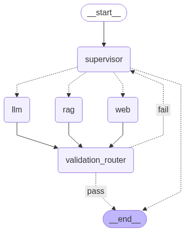

# Agentic RAG with Supervisor Node (LangGraph + Gemini + Pinecone)

This is a **production-grade, modular GenAI system** that uses an **Agentic architecture** to intelligently route user queries to the best response mechanism - RAG, LLM, or Web - using a `supervisor` node and a `validation router` with retry logic. 

It is built using **LangGraph**, **LangChain**, **Gemini 1.5 Flash**, and **Pinecone**, and is designed to be highly extensible, testable, and scalable.

---

## 🚀 Core Features

- ✅ **Agentic Routing:** Classifies questions into `rag`, `llm`, or `web` mode using a supervisor agent.
- 🔄 **Retry-Aware Validation:** Auto-retries incorrect answers up to 3 times before fallback.
- 🧠 **LangGraph-powered State Management:** Uses `TypedDict` and `operator.add` to persist state.
- 📄 **RAG Chain:** Retrieves domain-relevant knowledge and answers questions using Gemini.
- 🌐 **Web Search:** Integrates DuckDuckGoSearch for live info questions (e.g., weather, news).
- 🤖 **LLM Query:** Directly queries Gemini for opinion-based/general knowledge queries.
- 🧪 **Validation Router:** Evaluates output accuracy using heuristics.
- 💾 **Pinecone Vector Store:** Stores and retrieves embeddings for RAG via Google GenAI embeddings.

---
## 🧱 Architecture Overview

  
   
  <i>Figure: Modular agentic workflow combining Supervisor, RAG, Web, LLM, and Validation Router</i>

